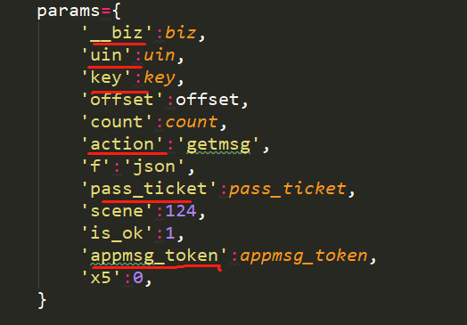

# 爬微信公众号
这是一个用用烂了的方法爬公众号的爬虫

唯一的技术含量是用到了fiddler

这是一个抓包的软件，介绍见官网：
https://www.telerik.com/fiddler

具体的使用方法：
下载，安装。

注意：Fiddler 是以代理web服务器的形式工作的，它使用代理地址:127.0.0.1，端口:8888。当Fiddler退出的时候它会自动注销，这样就不会影响别的 程序。不过如果Fiddler非正常退出，这时候因为Fiddler没有自动注销，会造成网页无法访问。解决的办法是重新启动下Fiddler。

配置

打开Fiddler  Tool->Fiddler Options->HTTPS 。  （配置完后记得要重启Fiddler）.

选中"Decrpt HTTPS traffic", Fiddler就可以截获HTTPS请求，第一次会弹出证书安装提示，若没有弹出提示，勾选Actions-> Trust Root Certificate

然后开始抓微信公众号的包

用最简单的用到不能再用的方法的时候，其中一个比较复杂的地方就是
在于破解发请求的时候提交的参数：

最常用的方法就是抓包：

上图中的参数并不是全部都是有用的，通过尝试得知，下面的几个参数就可以拿到请求：

然后开始运行得到下图所示的结果：

这里只输出了返回的json字符串、标题和时间，json字符串中什么都有，什么都可以自己得到，可以根据需求自己得到并解析：

